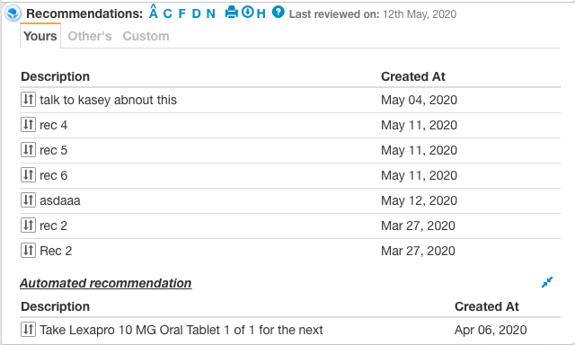
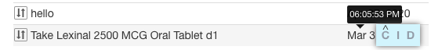
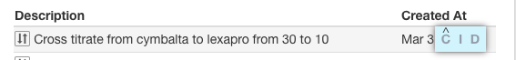

# Use exisitng table library Vs. extend vue draggable/b-table?

Variables optimizing for: Doctor time to A. Gather information (visual density) B. Change information (shortest hand movement).

## A. Change information (shortest hand movement)

1. KB to go up and down the data rows

2. Multi select using only KB or mouse.

3. Actions for each data row invoked using keyboard single key.

4. When multiple rows are selected then invoke "Multi select actions"

5. Drag to reorder rows. e.g. some recs are more important then others.

6. Double clicking on a data row executes the first action of that data row.

7. Pressing enter on a data row executes the first action of that data row.

## B. Gather information (visual density)

1. Tabbed tables -> First tab shows table 1 and 2nd tab shows table 2. Used at "Your recommendations" "Others recommendations"

   For the tabs each tab can be a table component. And the tabs are displayed using Vue’s <component> element with the is special attribute:
   https://vuejs.org/v2/guide/components.html#Dynamic-Components

2. Responsive tables https://elvery.net/demo/responsive-tables/ -> 

    Less important columns are hidden and that data is sent to tooltip. For e.g. in case of recommendations -> Created at and Actions are less important columns and they are hidden when width is less. The content of created at is sent to tooltip.

3. Each cell may have additional data passed in the Json to show in a tooltip

    
        
    Reason: 99% of the time date of recs added is enough. For the hour and time of rex added the data 		sent in json is shown in a tooltip.

4. The actions are shown as a overlay

    
    
    Reason: If there are 10 data rows with 5 actions each. We do not want to show 50 action icons. The first 		look is clean. When doctor gets into the context of working on a data row only then 5 action icons are 		shown.

## Libraries compared 

| URL                                          |  Responsive            |  Stars          | Size
|--                                            |--                      |--               |--
| https://github.com/huangshuwei/vue-easytable |                        |                 |
| https://github.com/ratiw/vuetable-2          |                        |                 |
| https://github.com/xaksis/vue-good-table     |                        |                 |

## Current choice:

Example of draggable and responsive table in VUE https://jsfiddle.net/d7jqtkon/

Libraries used:
1. https://sortablejs.github.io/Vue.Draggable/#/table-example -> This gives draggable feature
2. https://bootstrap-vue.org/docs/components/table -> This gives responsive feature
